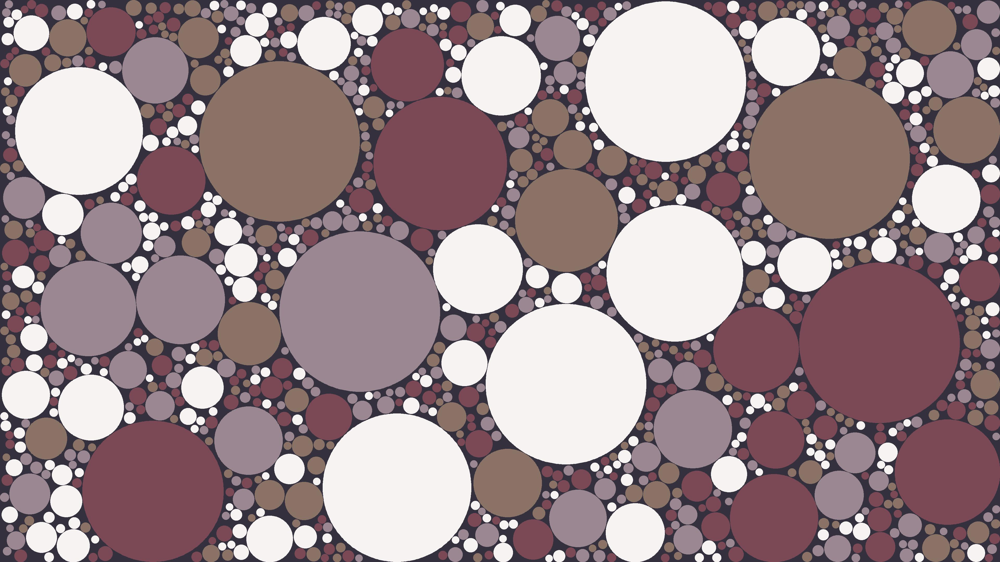
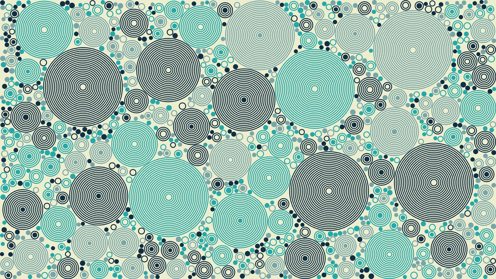

# Circle packing

An experiment with a simple circle packing implementation.

The degree of packing can be varied altering the `MIN_RADIUS`, `MAX_RADIUS` and `TOTAL_CIRCLE_ATTEMPTS` variables.

Example outputs (click to go to full resolution file):




With concentric circles:



With more variation in the colors of the circles, and thicker circles:


More samples in the `images` folder in this repo: https://github.com/anaulin/circle-packing/tree/master/images

See also: https://github.com/anaulin/square-packing

## Credits

This code is heavily based on Tim Holman's Generative Artistry Circle Packing tutorial: https://generativeartistry.com/tutorials/circle-packing/

## Development notes

Create Python virtual env:

```bash
 python3 -m venv .venv
```

Activate the virtual env:

```bash
$ source .venv/bin/activate
```

Deactivate:

```bash
$ deactivate
```

Install requirements:

```bash
$ pip install -r requirements.txt
```

Run:

```bash
$ python circle_pack.py
```
