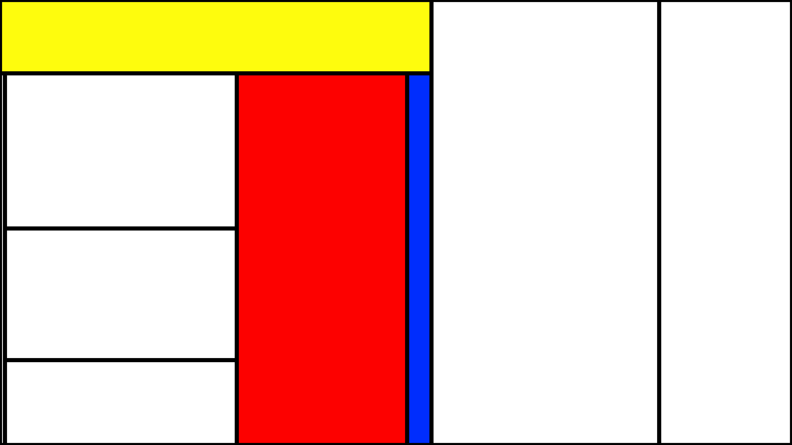
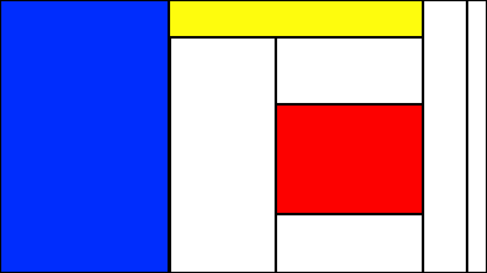

# auto-mondrian

Autogenerate something that looks vaguely like a Mondrian piece.

Example outputs:





See also:
* Random square packing: https://github.com/anaulin/square-packing
* Random circle packing: https://github.com/anaulin/circle-packing

## Development notes

Create Python virtual env:

```bash
 python3 -m venv .venv
```

Activate the virtual env:

```bash
$ source .venv/bin/activate
```

Deactivate:

```bash
$ deactivate
```

Install requirements:

```bash
$ pip install -r requirements.txt
```
