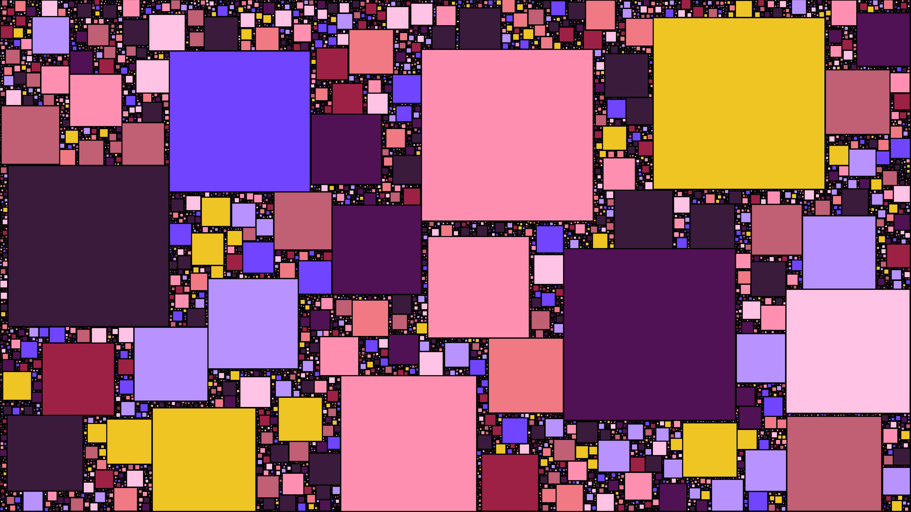
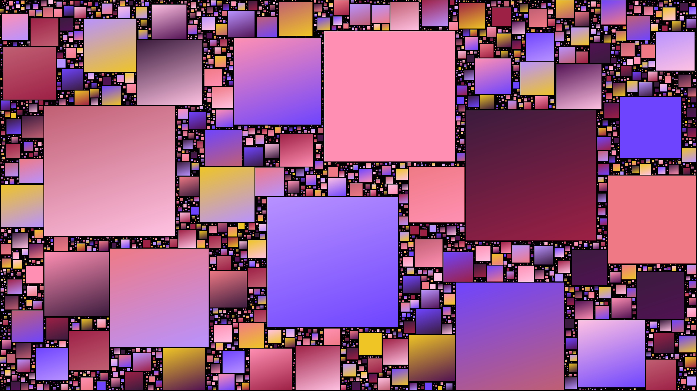

# Square packing

An experiment in generative art.

Example output:



With a linear gradient fill:




See also: https://github.com/anaulin/circle-packing

## Development notes

Create Python virtual env:

```bash
 python3 -m venv .venv
```

Activate the virtual env:

```bash
$ source .venv/bin/activate
```

Deactivate:

```bash
$ deactivate
```

Install requirements:

```bash
$ pip install -r requirements.txt
```
