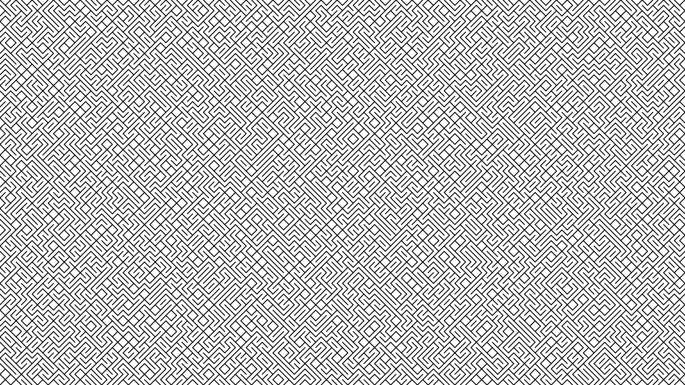

# Tiled lines

10 PRINT variants.

Example outputs:



## Development notes

Create Python virtual env:

```bash
 python3 -m venv .venv
```

Activate the virtual env:

```bash
$ source .venv/bin/activate
```

Deactivate:

```bash
$ deactivate
```

Install requirements:

```bash
$ pip install -r requirements.txt
```

## Credits

This code borrows heavily from Tim Holman's Generative Artistry tutorials: https://generativeartistry.com/
